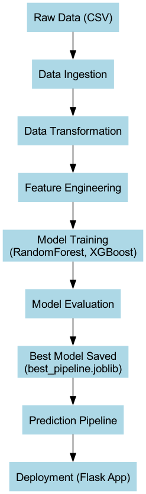
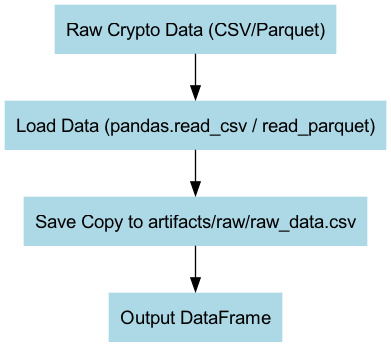
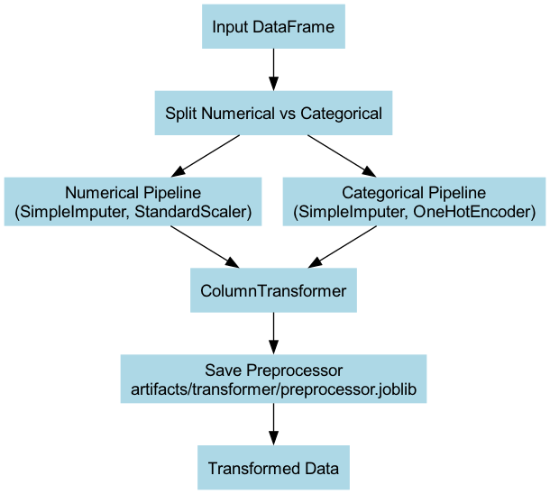
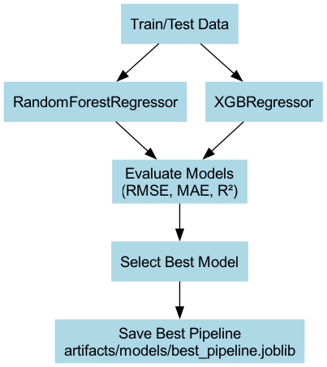
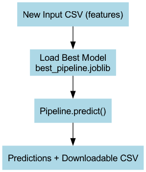

# 🚀 Cryptocurrency Volatility Prediction

## 📌 Project Overview
Cryptocurrency markets are notoriously volatile, making it crucial for traders and institutions to forecast volatility for **risk management, portfolio allocation, and informed decision-making**.  

This project builds a **complete ML pipeline** to predict cryptocurrency volatility based on historical OHLC (Open, High, Low, Close) prices, trading volume, and market capitalization.  

The system covers:  
✅ Data ingestion → transformation → feature engineering  
✅ Model training (RandomForest, XGBoost) → evaluation  
✅ Saving best pipeline → prediction  
✅ Local deployment with a Flask web app  

---

## 📂 Folder Structure

---

---
---

## ⚙️ Installation & Setup

1. **Clone the repository**
   ```bash
   git clone https://github.com/fahim-29/crypto_volatility_project.git
   cd crypto_volatility_project


## 📊 Results
- **Best Model**: RandomForest Regressor  
- **Performance**:  
  - RMSE: ~0.0057  
  - MAE: ~0.0022  
  - R²: ~0.95  

---

## 📖 Documentation
- [High-Level Design (HLD)](docs/HLD.md)  
- [Low-Level Design (LLD)](docs/LLD.md)  
- [Final Report](docs/Final_Report.md)  

---

## 📌 Flowcharts
### System Architecture


### Data Ingestion


### Data Transformation


### Model Training


### Prediction Pipeline


---

## 🚀 Future Improvements
- 🔹 Integrate LSTM/GRU for advanced time-series volatility forecasting.  
- 🔹 Deploy Flask app to **Heroku / AWS / GCP** for global access.  
- 🔹 Add dashboards with **Plotly/Dash or Streamlit** for better visualization.  

---

## 🙌 Acknowledgements
- Dataset source: Public cryptocurrency market data  
- Libraries: `pandas`, `scikit-learn`, `xgboost`, `flask`, `joblib`  
- Mentor guidance and project inspiration from real-world ML workflows  
