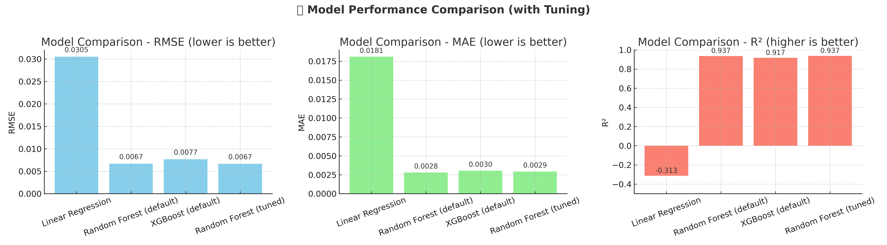

# 🚀 Cryptocurrency Volatility Prediction

##  Project Overview
Cryptocurrency markets are notoriously volatile, making it crucial for traders and institutions to forecast volatility for **risk management, portfolio allocation, and informed decision-making**.  

This project builds a **complete ML pipeline** to predict cryptocurrency volatility based on historical OHLC (Open, High, Low, Close) prices, trading volume, and market capitalization.  

The system covers:  
✅ Data ingestion → transformation → feature engineering  
✅ Model training (RandomForest, XGBoost) → evaluation  
✅ Saving best pipeline → prediction  
✅ Local deployment with a Flask web app  

---

## 📂 Folder Structure

```text
crypto_volatility_project/
│── data/                  # Dataset(s)
│   └── crypto_prices.csv
│
│── docs/                  # Documentation (HLD, LLD, Final Report)
│   ├── HLD.md
│   ├── LLD.md
│   └── Final_Report.md
│
│── flowchart/             # System flowcharts (DOT + PNG)
│   ├── data_ingestion.dot / .png
│   ├── data_transformation.dot / .png
│   ├── model_trainer.dot / .png
│   ├── pipeline_flow.dot / .png
│   └── prediction_pipeline.dot / .png
│
│── notebooks/             # Jupyter notebooks for EDA & model training
│   ├── 01_EDA_CryptoVolatility.ipynb
│   └── Model_Training.ipynb
│
│── src/                   # Source code
│   ├── components/        # Ingestion, transformation, trainer
│   ├── pipeline/          # Training & prediction pipelines
│   ├── utils/             # Logger, exception handler, helpers
│   └── features.py        # Feature engineering
│
│── static/                # CSS / static assets for Flask
│── templates/             # HTML templates for Flask
│── app.py                 # Flask web app
│── main.py                # Entry point (optional)
│── requirements.txt       # Project dependencies
│── README.md              # Project documentation (this file)
```


## ⚙️ Installation & Setup

- **Step 1. Cloning the repository.**

```

git clone https://github.com/fahim-29/crypto_volatility_project.git
cd crypto_volatility_project

```

- **Step 2. Create a conda environment.**

```

conda create -n crypto_volatility_env python=3.11 -y

```

```

conda activate crypto_volatility_env

```

- **Step 3. Install the requirements**

```

pip install -r requirements.txt

```

- **Step 4. Run the training pipeline (to train models and save the best one)**

```
python -m src.pipeline.training_pipeline
```

- **Step 5. (Optional) Test the prediction pipeline**

```

python -m src.pipeline.prediction_pipeline

```

- **Step 6. Start the Flask web app**

```

python app.py

```


## 📊 Results
- **Best Model**: RandomForest Regressor  
- **Performance**:  
  - RMSE: ~0.0057  
  - MAE: ~0.0022  
  - R²: ~0.95  

---

## 📊 Model Performance Comparison

I evaluated multiple models to predict cryptocurrency volatility.  
The results are summarized below:



### 🔎 Insights
- **Linear Regression** → Performed poorly (negative R²), not suitable for this dataset.  
- **Random Forest (default)** → Strong baseline with high R² (~0.94).  
- **XGBoost (default)** → Competitive performance, slightly lower than Random Forest.  
- **Random Forest (tuned)** → Achieved the **best performance** with R² ~0.937 and lowest RMSE/MAE.  
👉 Overall, the **tuned Random Forest Regressor** was selected as the best model for cryptocurrency volatility prediction.


## 📖 Documentation
- [High-Level Design (HLD)](docs/HLD.md)  
- [Low-Level Design (LLD)](docs/LLD.md)  
- [Final Report](docs/Final_Report.md)  

---

## 📌 Flowcharts
### System Architecture


### Data Ingestion


### Data Transformation


### Model Training


### Prediction Pipeline


---

## 🚀 Future Improvements
- 🔹 Integrate LSTM/GRU for advanced time-series volatility forecasting.  
- 🔹 Deploy Flask app to **Heroku / AWS / GCP** for global access.  
- 🔹 Add dashboards with **Plotly/Dash or Streamlit** for better visualization.  

---

## 🙌 Acknowledgements
- Dataset source: Public cryptocurrency market data  
- Libraries: `pandas`, `scikit-learn`, `xgboost`, `flask`, `joblib`  
- Mentor guidance and project inspiration from real-world ML workflows  


