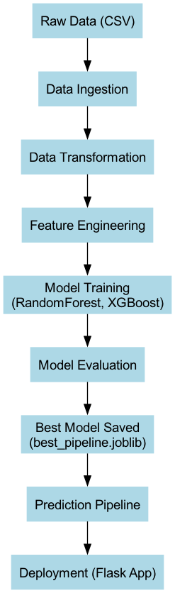
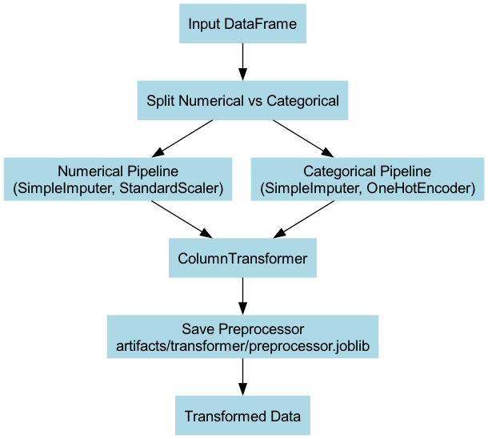
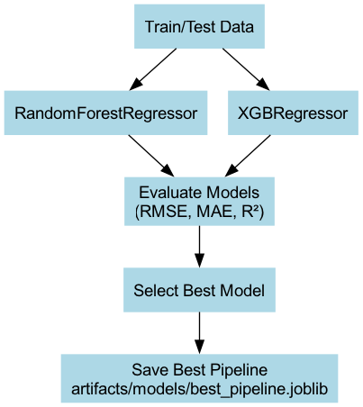
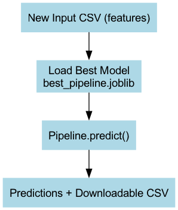

# High-Level Design (HLD)

## 📌 System Architecture
The system predicts cryptocurrency volatility using a modular ML pipeline.  
The following diagram shows the overall architecture:

---

## 📌 Major Components

### 1. Data Ingestion
- Loads raw historical cryptocurrency data (`crypto_prices.csv`).
- Saves a clean copy to `artifacts/raw/raw_data.csv`.

---

### 2. Data Transformation
- Splits data into numerical and categorical features.
- Applies preprocessing pipelines (imputation, scaling, encoding).
- Saves transformer to `artifacts/transformer/preprocessor.joblib`.

---

### 3. Feature Engineering
- Adds rolling volatility, liquidity ratios, ATR, and technical indicators.
- Saves engineered datasets:
  - `crypto_features_full.csv`
  - `crypto_features_model.csv` (model-ready).

---

### 4. Model Training
- Trains multiple ML models (RandomForest, XGBoost).
- Evaluates models using **RMSE, MAE, R²**.
- Saves the best-performing pipeline to `artifacts/models/best_pipeline.joblib`.

---

### 5. Prediction Pipeline
- Loads the saved best pipeline.
- Accepts new input CSV for predictions.
- Returns predicted volatility values and downloadable results.

---

### 6. Deployment (Flask App)
- User uploads CSV via web interface.
- Flask backend loads saved model and generates predictions.
- Predictions are displayed in the browser and available as a CSV download.
